# Container Runway Runtime - Architecture

## Overall Architecture

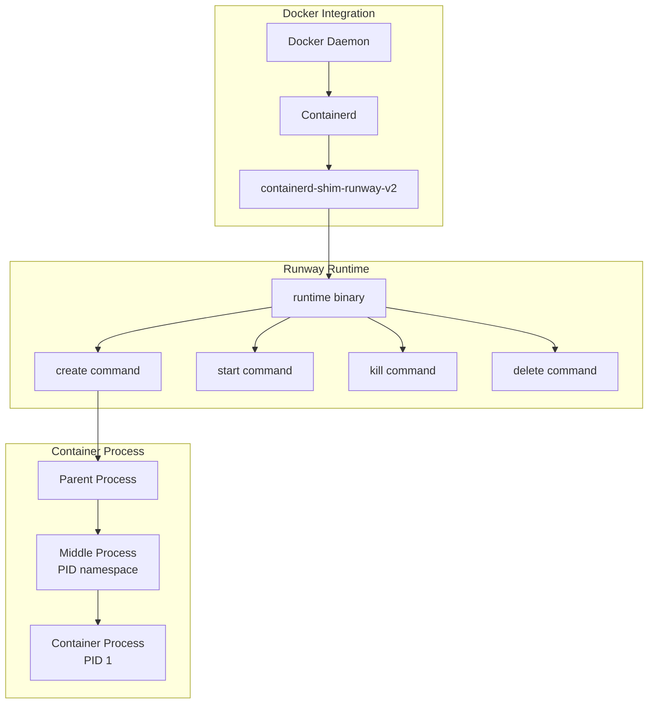

## Process Lifecycle

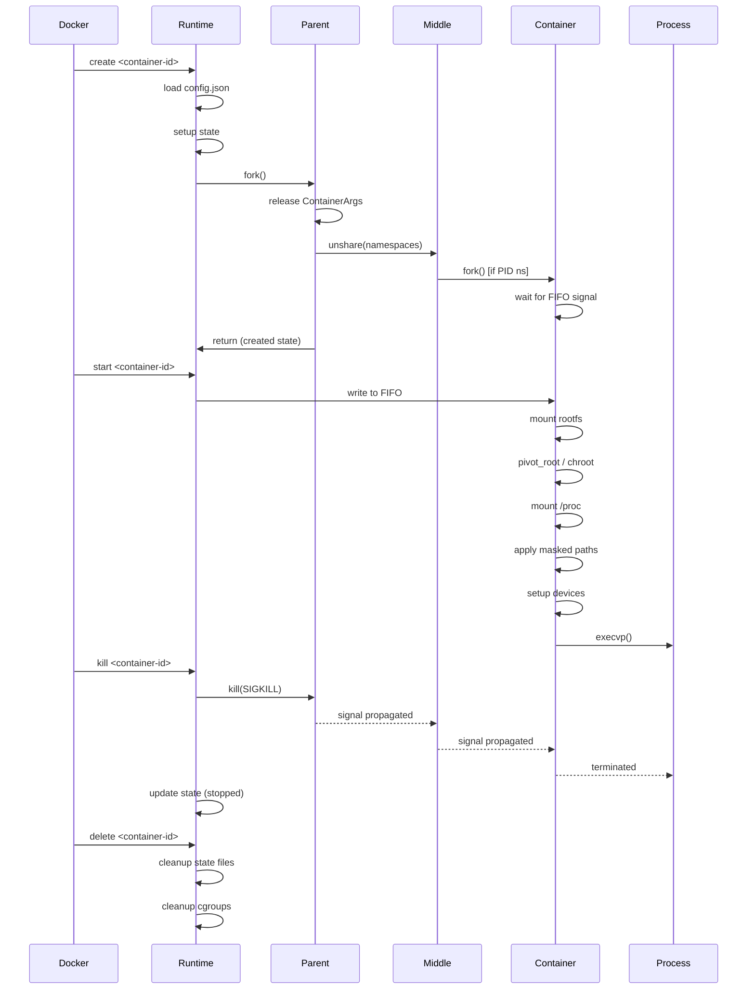

## Component Structure

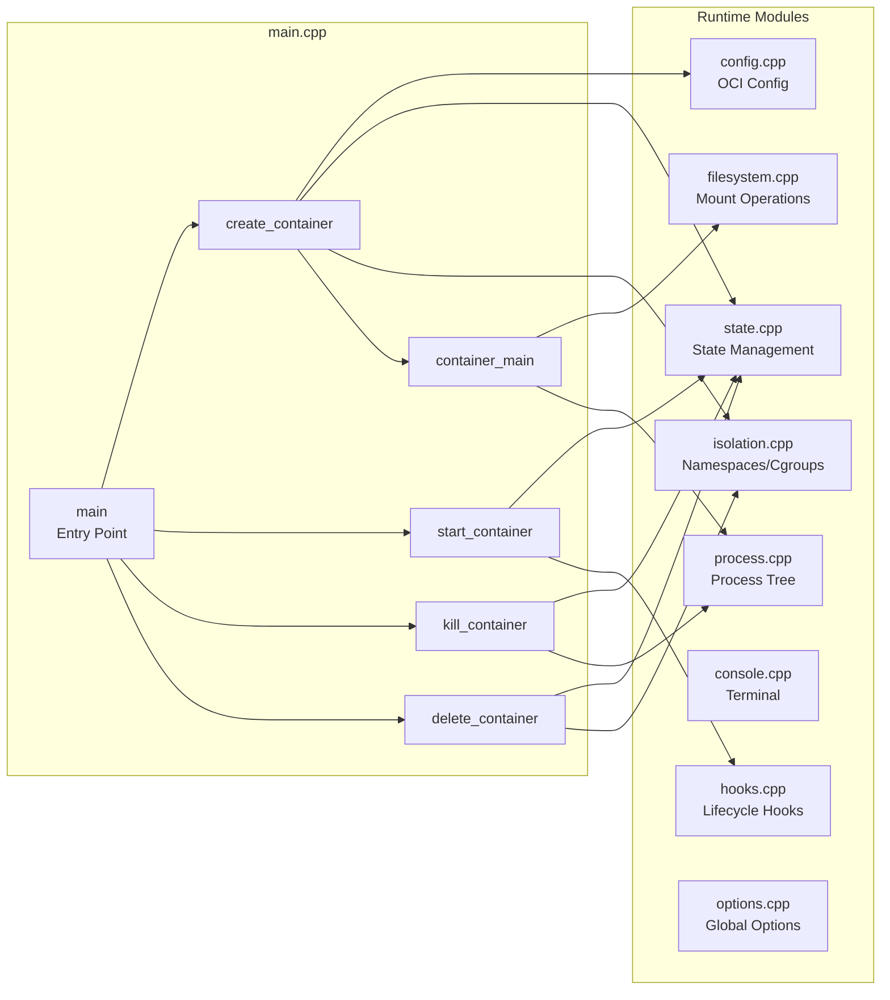

## Memory Management Flow

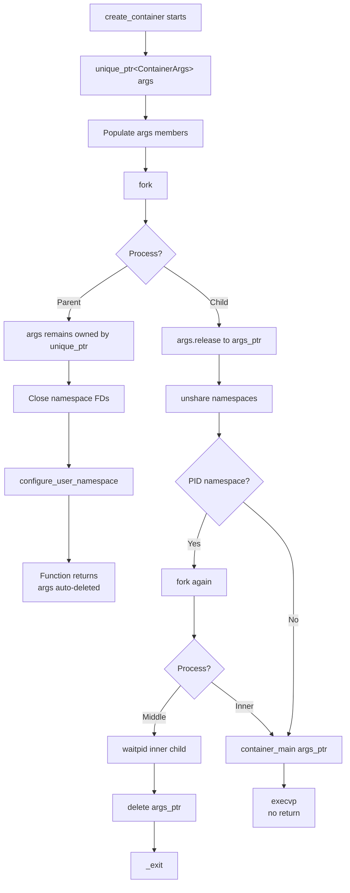

## State Management

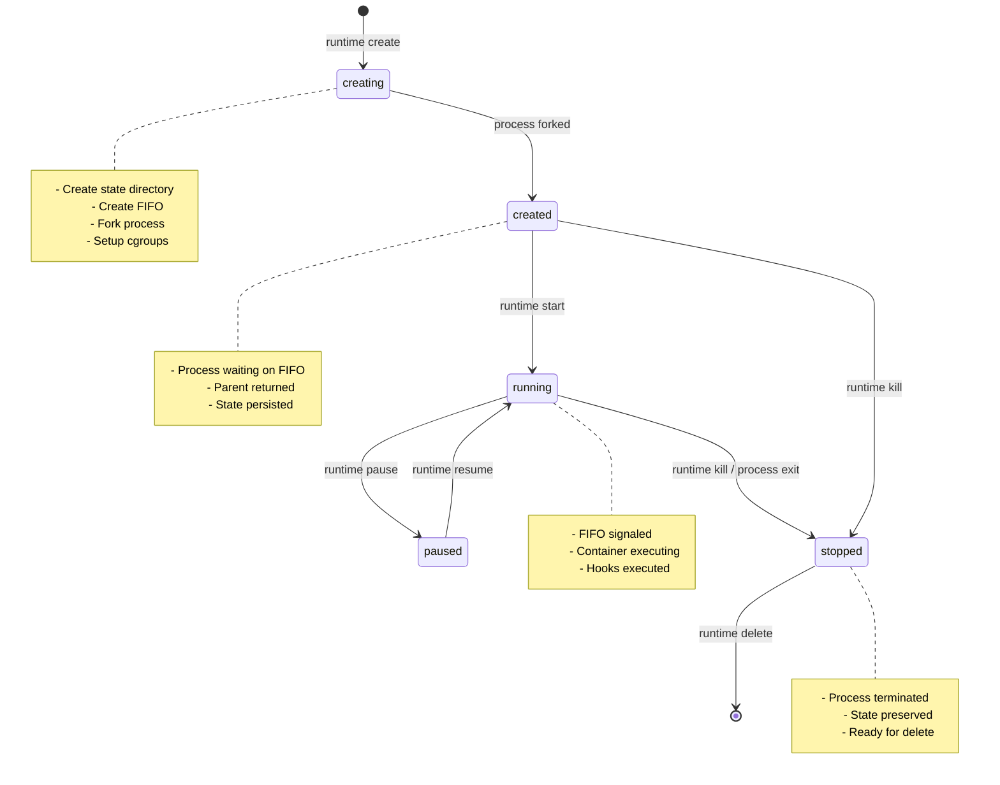

## Namespace Setup

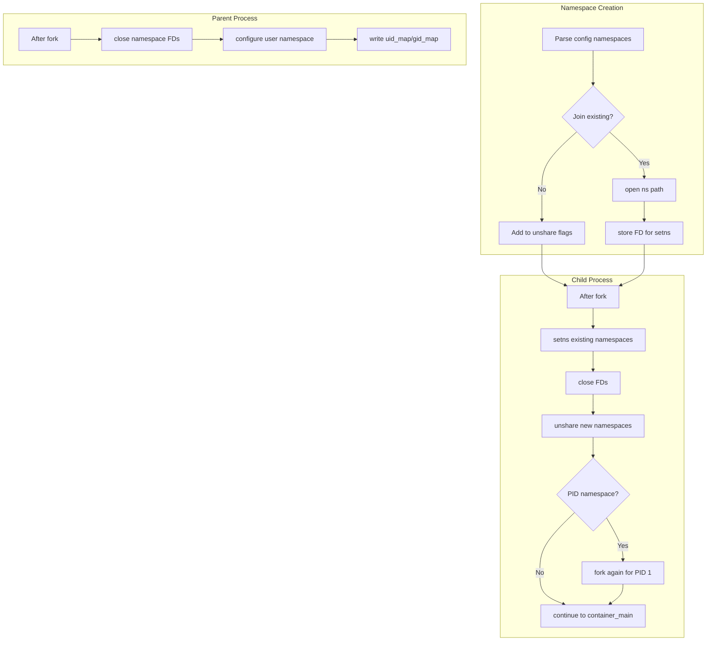

## Mount Operations Order

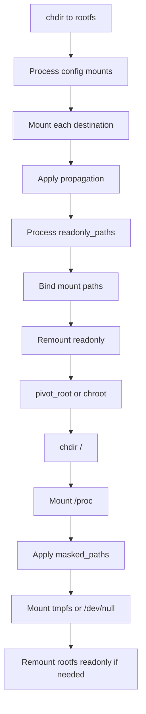

## File Structure

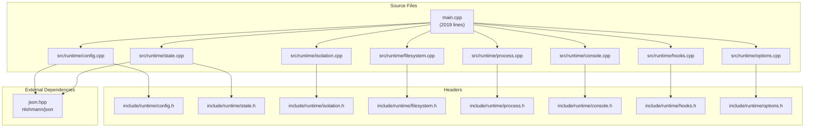

## Runtime State Directory

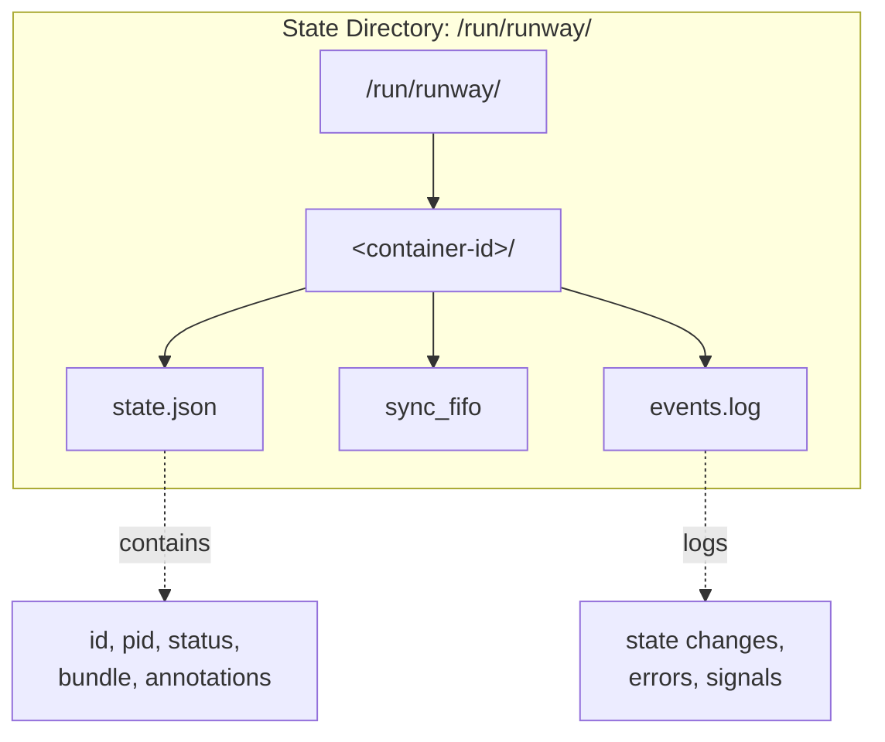

## Key Data Structures

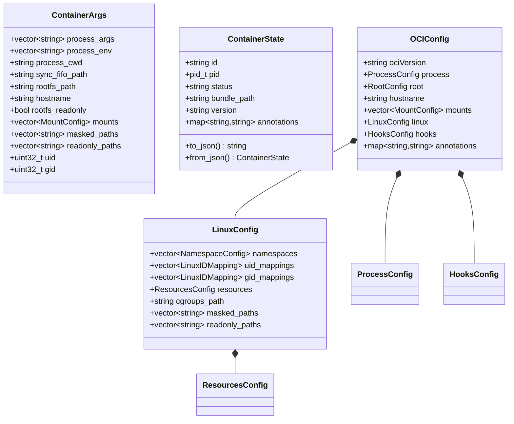

## Error Handling & Fixes

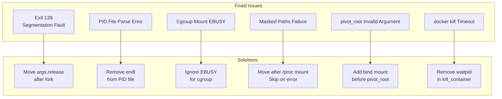
